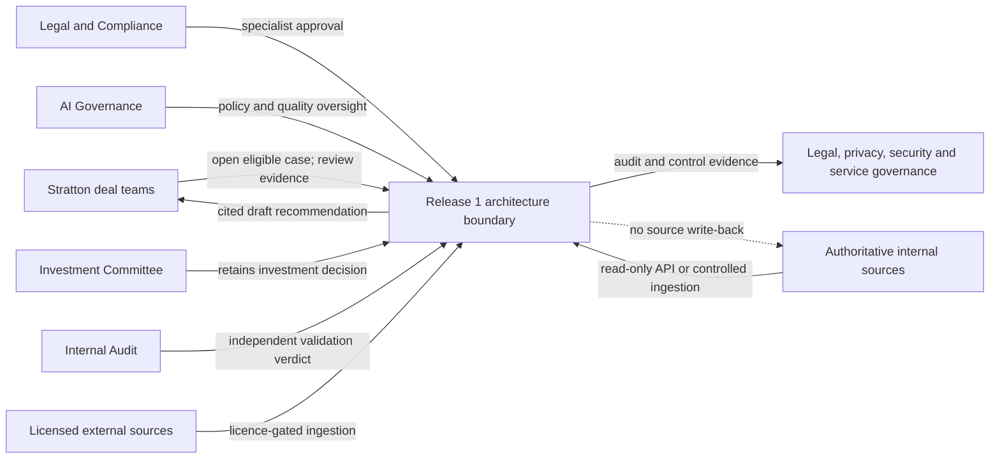
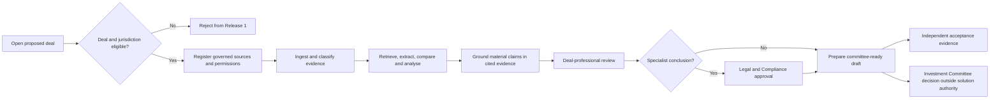
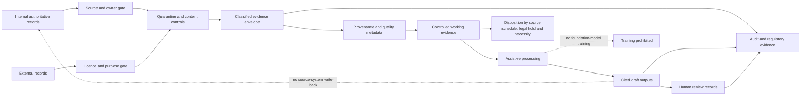
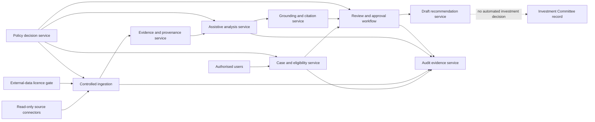
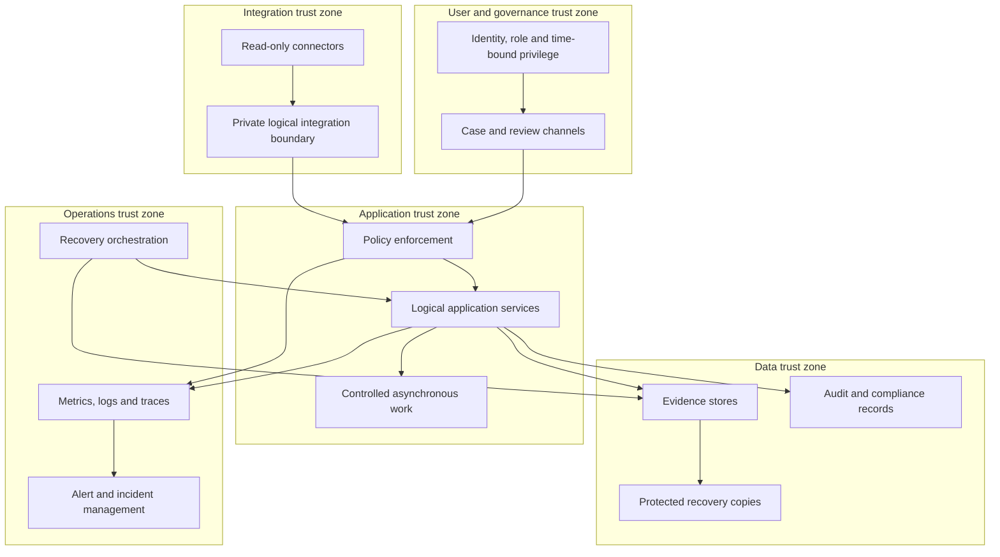

# Phase 2 — TOGAF Architecture: Stratton Release 1

**Case:** `Stratton-Europe-Captital`  
**Artifact prefix:** `stratton`  
**Status:** Candidate awaiting canonical hashing, AFF-A/AFF-B assurance and explicit human decision  
**Model-plan revision:** `3` (`../0-coordination/stratton-model-plan-revision-3.json`)  
**Approved requirements baseline:** `../1-requirements/stratton-requirements-catalogue.json`  
**Phase 1 approval:** `../approvals/1/stratton-phase-1-approval-1.json`

## 1. Executive architecture vision

Release 1 is a controlled, case-centred due-diligence capability for the first 20 eligible new
private-equity opportunities. It preserves authoritative source systems and human investment
authority while adding governed evidence ingestion, provenance, assistive analysis, citation,
mandatory review, independent validation and auditable operations.

The target is vendor-neutral. It defines Architecture Building Blocks (ABBs), trust boundaries and
control outcomes; it does not select Azure services, products, SKUs, regions, CIDRs, modules,
deployment topology or implementation plans.

| Outcome | Architecture response | Requirements |
|---|---|---|
| Median due diligence no more than three weeks | Case timestamps, controlled workflow, workload management and benefits evidence | BR-001, NR-003 |
| Controlled 20-deal rollout | Eligibility gate, rollout register and no wider admission | BR-002, TR-002 |
| Assistive rather than autonomous AI | Separated analysis, policy enforcement, draft-only state and mandatory human gates | AR-001, AR-002, FR-002 |
| Evidence-grounded quality | Provenance envelope, citation, benchmark evaluation and independent verdict | DR-004, NR-001, SR-008 |
| Sovereign, private and lawful handling | Location/transfer policy, data minimisation, identity controls and legal evidence | DR-003, DR-007, SR-001–SR-003, SR-007, SR-010 |
| Resilient and supportable service | Logical isolation, observability, incident ownership and recoverability | TR-001, TR-003, TR-004 |

### Context and vision view

**Concern:** shared boundary between users, authoritative evidence, governance and retained investment
authority.  
**Requirements:** BR-002, FR-001, FR-002, AR-001, AR-002, DR-001, DR-002, SR-008, IR-001.

### Scope and tailoring

This iteration combines TOGAF Phases A–D at target-architecture depth: vision, target Business, Data,
Application and logical Technology/Security/Operations architectures, with gaps, candidate decisions,
risks and traceability. Baseline statements are limited to approved evidence. Opportunities,
migration detail, solution selection, implementation, deployment and runtime testing are deferred.
Requirements Management remains continuous through the coverage catalogue and open controls.

### Constraints and assumptions

- The 31 active Phase 1 Must requirements are immutable inputs; this candidate does not change them.
- Existing deal-room, CRM, finance, ESG and legal systems remain authoritative.
- Production data and routine processing remain within locations approved by General Counsel; the
  exact list remains open under `VAL-005`.
- There are no new architecture assumptions. Unknown detail is retained as an owner-bound gap.
- All seven approved residual validation gaps remain open and unwaived.

## 2. Stakeholders and concerns

| Stakeholder | Power / interest | Engagement | Primary concerns | Architecture response |
|---|---|---|---|---|
| Chief Investment Officer | High / High | Manage closely | Outcome, quality, controlled rollout | Case metrics, approval workflow, workload controls |
| Investment Committee | High / High | Manage closely | Retained decision authority | Draft-only outputs; no automated decision |
| General Counsel and DPO | High / High | Manage closely | Jurisdiction, privacy, transfer, legal evidence | Policy gates, evidence register, location and transfer controls |
| Compliance and Fund Legal | High / High | Manage closely | SFDR/AIFMD evidence and specialist approval | Reproducible lineage and mandatory approval |
| Head of AI Governance | High / High | Manage closely | AI boundary, quality, transparency and classification | Guardrails, evaluation, logging and model-use controls |
| Internal Audit | High / High | Manage closely | Independence and complete acceptance evidence | Read-only evidence access and independent verdict boundary |
| Deal professionals | Low / High | Keep informed | Usability, speed, explainability and corrections | Case workspace, citations and human review |
| Enterprise Platform / Integration / Identity / Network | High / High | Manage closely | Operability, isolation and interfaces | Logical service, trust and integration boundaries |
| Service Operations / Business Continuity | High / High | Manage closely | Support, alerts, recovery and evidence | Observability, incident and recovery ABBs |
| Source and records owners | High / High | Manage closely | Authority, quality, retention and use | Source gates, provenance and disposition controls |
| Programme Delivery | High / Low | Keep satisfied | Scope, dependencies and controlled progression | Explicit gaps and AFF-3 handoff constraints |

## 3. Architecture principles

These are design rules derived from the approved requirements; they introduce no independent
requirement.

| Principle | Statement | Rationale | Implications |
|---|---|---|---|
| Human authority is final | AI assists; accountable humans review, approve and decide. | AR-001, AR-002 and FR-002 retain authority. | Outputs remain drafts; prohibited actions are unavailable and logged. |
| Evidence before assertion | Every material claim is traceable to accessible governed evidence. | DR-004 and NR-001 require provenance and citation. | Evidence metadata and citation are mandatory processing gates. |
| Authoritative sources stay authoritative | Integration is read-only or controlled ingestion. | IR-001 prohibits AI write-back. | Connectors cannot grant AI-generated source writes. |
| Govern data at admission | Ownership, licence, purpose, classification and quality are checked before use. | DR-001–DR-004 and DR-007 constrain admission. | Failed gates quarantine or reject evidence. |
| Minimise and contain | Process only necessary data within approved location and transfer boundaries. | DR-003, SR-001–SR-003. | Location, purpose and transfer policies apply to data, logs, inputs and outputs. |
| Least privilege is time-bound and auditable | Access is explicit, minimal, temporary where privileged, and recorded. | SR-007. | Separate duties, elevation, emergency access and review are required. |
| Controls fail closed | Missing approval or policy evidence blocks progression. | FR-002, DR-002, SR-003 and SR-006. | No silent bypass; exceptions follow governed change and evidence. |
| Operations produce evidence | Security, service and business events are observable and retained appropriately. | NR-002, SR-009, TR-003 and TR-004. | Metrics, logs, traces, alerts and recovery evidence share correlation identifiers. |
| Resilience follows criticality | Recovery protects case state, evidence and audit integrity to approved objectives. | TR-003. | Recoverable state and tested procedures must satisfy RTO/RPO. |
| Architecture precedes product | Logical ABBs remain stable while AFF-3 selects compliant SBBs. | Phase boundary and traceability discipline. | No vendor-specific choice is part of this baseline. |

## 4. Target Business Architecture

### Capabilities

| L1 capability | L2 capabilities | Owner(s) | Requirements |
|---|---|---|---|
| Govern Release 1 | Deal eligibility; jurisdiction eligibility; rollout control; benefits measurement | Deal Operations, General Counsel, Programme Delivery, CIO | BR-001, BR-002, TR-002 |
| Manage due-diligence cases | Case opening; evidence request; workflow state; committee-ready drafting | CIO, deal professionals | FR-001, AR-002 |
| Govern evidence | Source admission; licensing; classification; provenance; quality; retention | Source owners, General Counsel, DPO | DR-001–DR-007 |
| Perform assistive analysis | Retrieval; extraction; comparison; anomaly/risk/ESG analysis; citation | AI Governance | FR-001, AR-001, NR-001 |
| Assure human oversight | Deal review; specialist approval; decision separation | CIO, Legal, Compliance, Investment Committee | FR-002, AR-002, NR-002 |
| Validate independently | Benchmark governance; test evidence; independent verdict | Internal Audit, Model Risk | SR-008, NR-001–NR-003 |
| Operate and protect | Identity; policy; monitoring; incident; continuity; legal/regulatory evidence | CISO functions, Service Operations, Business Continuity, Legal | SR-001–SR-010, TR-001, TR-003, TR-004 |

### Value stream

`Qualify opportunity → establish governed evidence → analyse with citations → review and approve →
prepare committee-ready draft → independently validate Release 1 → measure outcome`

The Investment Committee decision is adjacent to, but outside, solution decision authority.

### Business view

**Concern:** controlled acceleration without transferring investment authority.  
**Requirements:** BR-001, BR-002, FR-001, FR-002, AR-001, AR-002, SR-008, TR-002.

## 5. Target Data Architecture

### Core data entities

| Entity | Accountable owner | Classification / rule | Lifecycle |
|---|---|---|---|
| Due-diligence case | Head of Deal Operations | Highly confidential when linked to deal data | Open, qualify, process, close; retain by authoritative schedule |
| Eligibility decision | Deal Operations / General Counsel | Controlled approval evidence | Immutable decision history |
| Source registration | Respective source owner | Owner, authority, purpose and interface | Review on material change |
| Evidence item | Respective data owner | Classification inherited or strengthened; personal data minimised | Quarantine, admit, use, hold or dispose |
| Evidence envelope | Respective data owner | Provenance, owner, timestamp, licence, quality and correlation | Travels with every derived item |
| External licence decision | General Counsel / data owner | Legal approval evidence | Must precede use |
| Analysis result | Head of AI Governance | Draft, derived, cited and quality-marked | Reviewable; never authoritative source |
| Material claim and citation | CIO / source owner | Claim-to-evidence relationship | Retained with output and review |
| Review / approval | Named reviewer | Auditable human action | Append-only evidence |
| Draft recommendation | CIO | Draft until required reviews complete | Presented to committee; not a system decision |
| Policy / exception decision | Accountable policy owner | Purpose, location, transfer, access or control result | Versioned and auditable |
| Audit / operational event | Service Operations / control owner | Highly confidential as applicable | Correlated; governed retention |
| Validation evidence / verdict | Internal Audit | Independent assurance evidence | Read-only to delivery and operations |

### Data rules

1. Ingestion creates a classified evidence envelope before content becomes available to analysis.
2. Derived content preserves source lineage, processing context, quality status and citations.
3. Personal data is purpose-screened and minimised; unapproved special-category data is rejected.
4. External evidence remains unavailable until licence and permitted AI use are approved.
5. Temporary working copies follow necessity-based deletion, source schedules and legal holds.
6. Stratton data cannot be used for foundation-model training.
7. Production-confidential data remains in production; non-production uses synthetic data.

### Data-flow view

**Concern:** provenance, lawful use, containment, retention and no write-back/training.  
**Requirements:** DR-001–DR-007, SR-001–SR-005, SR-010, IR-001, TR-001.

## 6. Target Application Architecture

| Logical application service | Responsibility | Key interfaces | Requirements |
|---|---|---|---|
| Case and Eligibility | Case identity, 20-deal limit, deal/jurisdiction gates, timestamps | Workflow, policy, audit | BR-001, BR-002 |
| Source Connector | Read-only access or controlled ingestion | Authoritative sources, ingestion | DR-001, IR-001 |
| External Licence Gate | Permitted-use approval before external data access | Legal evidence, ingestion | DR-002 |
| Controlled Ingestion | Quarantine, classification, content and admission controls | Connectors, evidence service, policy | DR-003, DR-007 |
| Evidence and Provenance | Evidence envelopes, lineage, quality and disposition metadata | Ingestion, analysis, audit | DR-004, DR-005, SR-004, SR-005 |
| Assistive Analysis | Retrieval, extraction, comparison, anomaly, risk and ESG analysis | Evidence, citation, policy | FR-001, AR-001, DR-006, NR-001 |
| Grounding and Citation | Claim-to-source association and accessibility check | Analysis, workflow | DR-004, NR-001 |
| Review and Approval Workflow | Deal review, specialist approval and draft state | Users, draft, audit | FR-002, AR-002, NR-002 |
| Draft Recommendation | Assemble reviewed committee-ready draft | Workflow, committee record | FR-001, AR-002 |
| Policy Decision | Evaluate purpose, location, transfer, identity, role and control evidence | All enforcement points | SR-001–SR-003, SR-006, SR-007, SR-010 |
| Quality Evaluation | Benchmark, negative-test and performance evidence boundary | Analysis, Internal Audit | SR-008, NR-001–NR-003 |
| Audit Evidence | Correlated business, data, AI, access and control history | All services, assurance | SR-004, SR-006, SR-008, SR-009, NR-002 |

### Application and integration view

**Concern:** composable assistive services with enforced human and source boundaries.  
**Requirements:** FR-001, FR-002, AR-001, AR-002, DR-001, DR-002, DR-004, IR-001, NR-001, NR-002.

## 7. Logical Technology, Security, Operations and Resilience Architecture

### Logical platform decomposition

| Layer | ABBs | Required characteristics |
|---|---|---|
| Experience and workflow | ABB-01, ABB-07, ABB-08 | Role-aware, draft-only, accessible evidence, mandatory approvals |
| Integration | ABB-02, ABB-03, ABB-17 | Read-only/controlled ingress, quarantine, licence and policy enforcement |
| Intelligence | ABB-05, ABB-06, ABB-16 | Assistive processing, grounding, evaluation, no training use |
| Data | ABB-04, ABB-09 | Classified envelopes, lineage, legal hold, disposition and production isolation |
| Security and governance | ABB-10, ABB-11, ABB-12, ABB-18 | Fail-closed policy, least privilege, complete audit and legal evidence |
| Operations | ABB-13, ABB-14, ABB-19 | Correlated telemetry, incidents, recovery and workload objectives |
| Isolation | ABB-15 | Separate development, test and production trust boundaries |

### Trust and control model

- Every actor and workload has an explicit identity and authorised purpose.
- Policy decisions are logically separated from enforcement points; enforcement occurs at admission,
  access, analysis, review and transfer boundaries.
- Privileged access uses Stratton-controlled identities, EU-based authorised personnel, least
  privilege, time-bound elevation, full audit and governed emergency access.
- Application, integration, data and operations are separate logical trust zones with controlled
  flows. Public exposure is not required by the target architecture.
- Security and privacy events correlate to case, evidence, actor, policy and processing identifiers
  without placing unnecessary sensitive content in telemetry.

### Operations and resilience model

| Concern | Logical response | Objective |
|---|---|---|
| Availability | Health observation, dependency status and controlled degradation | 99.9% during approved business hours |
| Recovery | Protected recoverable state, runbooks and recovery orchestration | RTO ≤4h; RPO ≤1h |
| Support | 8x5 ownership, critical-alert routing and incident evidence | Every critical alert detected and assigned |
| Performance | Interactive path separated from controlled pack work; admission and workload controls | p95 <5s; typical pack ≤30m |
| Audit integrity | Append-only logical event history and protected assurance records | Complete material review and control evidence |
| Independent validation | Delivery cannot issue or alter Internal Audit verdict | One independent verdict |

### Technology, security and operations view

**Concern:** isolation, private logical connectivity, controlled privilege, observability and recovery.  
**Requirements:** DR-007, SR-001–SR-003, SR-006–SR-010, TR-001, TR-003, TR-004, NR-003.

## 8. Architecture Building Blocks

ABBs are vendor- and product-neutral. No Solution Building Block (SBB) is selected in Phase 2.

| ABB | Name | Responsibility | Requirements |
|---|---|---|---|
| ABB-01 | Case and Eligibility Management | Case limit, eligibility, state and timestamps | BR-001, BR-002 |
| ABB-02 | Governed Source Connectivity | Read-only APIs and controlled source access | DR-001, IR-001 |
| ABB-03 | Controlled Ingestion | Quarantine, content, classification and admission controls | DR-003, DR-007, IR-001 |
| ABB-04 | Evidence and Provenance | Evidence envelope, lineage, quality and citation context | DR-004, SR-004 |
| ABB-05 | Assistive Analysis | Retrieval, extraction, comparison, anomaly/risk/ESG analysis | FR-001, AR-001, DR-006 |
| ABB-06 | Grounding and Citation | Material claim-to-governed-source binding | DR-004, NR-001 |
| ABB-07 | Human Review and Approval | Deal, Legal and Compliance review gates | FR-002, NR-002 |
| ABB-08 | Decision Rights Guardrail | Draft-only state and retained committee authority | AR-001, AR-002 |
| ABB-09 | Data Governance and Lifecycle | Minimisation, classification, legal hold and disposition | DR-003, DR-005, DR-007, SR-003, SR-005 |
| ABB-10 | Policy Decision and Enforcement | Purpose, location, transfer and control gates | SR-001, SR-002, SR-003, SR-006, SR-010 |
| ABB-11 | Identity and Privileged Access | Controlled identity, role, elevation and emergency access | SR-007 |
| ABB-12 | Audit Evidence | Correlated immutable logical evidence across material actions | SR-004, SR-006, SR-008, SR-009, NR-002 |
| ABB-13 | Observability and Incident Management | Metrics, logs, traces, alerting and incident ownership | TR-004, SR-009 |
| ABB-14 | Resilience and Recovery | Protected state, recovery and continuity evidence | TR-003, SR-009 |
| ABB-15 | Environment and Data Isolation | Separate environments and synthetic non-production data | TR-001, SR-001 |
| ABB-16 | Quality Evaluation and Independent Validation | Benchmark, negative, performance and verdict evidence | SR-008, NR-001, NR-002, NR-003 |
| ABB-17 | External Data Licence Gate | AI-use licence approval before access | DR-002 |
| ABB-18 | Legal and Regulatory Evidence | GDPR, SFDR, AIFMD, AI and DORA-aligned evidence | SR-003–SR-006, SR-009, SR-010 |
| ABB-19 | Workload and Performance Management | Interactive and pack-processing objectives | NR-003, BR-001 |

## 9. Candidate architecture decisions

Each decision is proposed, not yet approved. Human evidence is the future explicit Phase 2 decision;
the listed upstream evidence confirms intent but does not approve this architecture.

| ID | Decision and rationale | Alternatives considered | Requirements / risks | Implications | Status / human evidence |
|---|---|---|---|---|---|
| AD-001 | Use a case-centred workflow as the control and measurement spine. It binds eligibility, evidence, review and cycle time. | Document-only workspace; uncoordinated tools | BR-001, BR-002; R2-01 | Every material event carries a case identifier. | PROPOSED; Phase 2 decision pending; INT-D-001/008 |
| AD-002 | Preserve source authority through read-only connectors or controlled ingestion. | Write-back; source replacement | DR-001, IR-001; R2-02 | Source permissions and interface evidence must deny AI writes. | PROPOSED; pending; INT-D-006 |
| AD-003 | Require a classified evidence envelope with provenance, owner, timestamp, licence and quality. | Metadata held separately or optionally | DR-003, DR-004, DR-007; R2-03 | Evidence without complete metadata is unavailable to analysis. | PROPOSED; pending; INT-D-003 |
| AD-004 | Separate assistive analysis from review, approval and investment decision authority. | Single autonomous agent; advisory-only without gates | FR-002, AR-001, AR-002; R2-04 | Analysis cannot transition a draft through required gates. | PROPOSED; pending; INT-D-004 |
| AD-005 | Use logically central policy decisions with enforcement at every trust boundary. | Controls only in user interface; manual policy checks | SR-001–SR-003, SR-006, SR-007, SR-010; R2-05 | Fail-closed admission, access, analysis, review and transfer gates. | PROPOSED; pending; INT-D-002/007 |
| AD-006 | Separate development, test and production as distinct trust and data boundaries. | Shared environment; copied production data | TR-001, SR-001; R2-06 | Synthetic non-production data and isolated access/evidence. | PROPOSED; pending; INT-D-006 |
| AD-007 | Separate interactive requests from controlled document-pack work at the logical level. | One undifferentiated synchronous path | NR-003, TR-004; R2-07 | Work admission, progress and failure are observable; product choice is deferred. | PROPOSED; pending; INT-D-006 |
| AD-008 | Protect case state, evidence, audit and policy records as recoverable service state. | Recover only source documents; best-effort restoration | TR-003, SR-009; R2-08 | AFF-3 must show how each state class meets RTO/RPO and integrity needs. | PROPOSED; pending; INT-D-006/009 |
| AD-009 | Isolate Internal Audit verdict evidence from delivery modification. | Model Risk verdict; delivery-owned acceptance | SR-008; R2-09 | Model Risk advises methods; only Internal Audit issues the verdict. | PROPOSED; pending; INT-D-009 |
| AD-010 | Quarantine external data until licence, purpose and AI-use permission pass. | Post-ingestion legal review; source allow-list alone | DR-002, SR-003; R2-10 | External content cannot reach analysis before approval. | PROPOSED; pending; INT-D-003 |

Approval of Phase 2 would accept these decisions as the vendor-neutral baseline. Rejection or material
amendment requires candidate revision, renewed hashing and assurance.

## 10. Baseline-to-target gap analysis

| Capability / component | Baseline state | Target state | Gap type | Priority | Remediation approach |
|---|---|---|---|---|---|
| Authoritative business systems | Existing deal-room, CRM, finance, ESG and legal systems remain authoritative | Same authority with governed read-only connectivity | Carried Forward | High | Preserve ownership; AFF-3 maps compliant interfaces |
| Release case control | No approved evidence of one cross-domain case control | Eligibility, 20-deal boundary, timestamps and state | New | High | Realise ABB-01 |
| Evidence admission | Source domains are known; exact instances and operational mappings remain open | Owner, licence, purpose, classification and quality gates | Changed | High | Realise ABB-02/03/17; close VAL-004 before production ingestion |
| Provenance and lineage | Required metadata is defined but no target service exists | Evidence envelope and end-to-end claim lineage | New | High | Realise ABB-04/06 |
| Assistive analysis | Source describes desired AI infusion; no approved target architecture existed | Bounded assistive analysis with no prohibited actions | New | High | Realise ABB-05/08/16 |
| Human control | Existing human authority is retained; integrated gate evidence is not established | Mandatory deal and specialist approvals with audit | Changed | High | Realise ABB-07/08/12 |
| Privacy and sovereignty | Outcomes are approved; exact locations and exception evidence remain open | Enforced purpose, location and transfer decisions | Changed | High | Realise ABB-09/10/18; close VAL-005 |
| Privileged access | Required outcomes are approved; target enforcement is not selected | Controlled identity, least privilege, elevation and audit | Changed | High | Realise ABB-11 |
| Environment separation | Requirement approved; target logical zones now defined | Separate trust/data boundaries and synthetic non-production data | New | High | Realise ABB-15 |
| Operations and resilience | Service objectives and owners are approved; detailed definitions remain open | Correlated observability, incident and recovery capabilities | Changed | High | Realise ABB-13/14/19; close VAL-002 |
| Regulatory evidence | Applicability boundaries exist; detailed official mappings remain open | Evidence capability with no unsupported compliance claim | Changed | High | Realise ABB-18; retain VAL-001, AFFB-RES-001/002 |
| Independent validation | Internal Audit role is approved | Segregated evidence and verdict boundary | New | High | Realise ABB-16 and AD-009 |

## 11. Open controls, risks and transition implications

### Approved residual controls carried forward

| ID | Open control and owner | Architecture treatment | Closure boundary |
|---|---|---|---|
| VAL-001 | General Counsel: entity-specific DORA applicability/exemption and obligations | ABB-18 retains conditional evidence and prevents formal claim | Before formal DORA claim or scope change |
| VAL-002 | CIO and Service Operations: business hours, typical pack and critical-alert criteria | ABB-13/19 accept governed definitions | Before service/performance acceptance |
| VAL-003 | Deal Operations, AI Governance, Legal, Compliance and CIO: eligibility, benchmark, fields, severity and exceptions | ABB-01/16 consume approved definitions | Before Internal Audit validation |
| VAL-004 | Source and records owners: exact instances, schedules, volumes and remediation | ABB-02/03/09 require source register | Before production ingestion |
| VAL-005 | General Counsel: approved EU/EEA locations and exception evidence | ABB-10/18 enforce approved list and process | Before production location/transfer acceptance |
| AFFB-RES-001 | General Counsel and AI Governance: AI Act role/use-case classification | ABB-18 stores assessment; ABB-10 blocks unsupported classification | Before production or classification claim |
| AFFB-RES-002 | Legal/compliance owners: official citations, dates and article mappings | ABB-18 preserves detailed evidence slot | Before formal regulatory representation |

### Architecture risks

| ID | Risk | Impact | Owner | Treatment / linked gaps |
|---|---|---|---|---|
| R2-01 | Eligibility or timestamp definitions diverge across teams | Invalid rollout and outcome evidence | CIO / Deal Operations | ABB-01; VAL-003 |
| R2-02 | Source connector permissions exceed read-only boundary | Source integrity or unauthorised write | Integration Lead | ABB-02/03; AD-002 |
| R2-03 | Incomplete provenance reaches analysis | Unsupported claims and failed audit | Data owners / AI Governance | ABB-04/06; fail closed |
| R2-04 | Human gates are bypassed under time pressure | Autonomous or unapproved investment use | CIO / Legal / Compliance | ABB-07/08/12 |
| R2-05 | Policy differs across channels or workloads | Residency, privacy or access breach | CISO / General Counsel / DPO | ABB-10; common decision semantics |
| R2-06 | Confidential production data leaks into non-production | Privacy and confidentiality harm | Enterprise Platform / CISO | ABB-15; synthetic data only |
| R2-07 | Unknown pack/volume characteristics invalidate performance design | Missed three-week or service targets | Enterprise Platform / CIO | ABB-19; VAL-002/004 |
| R2-08 | Recovery restores data without consistent audit/policy state | Untrustworthy evidence after incident | Business Continuity | ABB-14; AD-008 |
| R2-09 | Validation evidence can be altered by delivery | Loss of independent assurance | Internal Audit | ABB-16; AD-009 |
| R2-10 | External licence terms are ambiguous or change | Unlawful or unlicensed AI use | General Counsel / data owner | ABB-17; block until approved |
| R2-11 | Regulatory classification or official mapping remains incomplete | Unsupported compliance representation | General Counsel / AI Governance | AFFB-RES-001/002; no formal claim |
| R2-12 | AFF-3 solution mapping weakens logical control boundaries | Architecture divergence | Human architect / AFF-3 | Compliance review against every ABB and AD |

Transition implications are limited to sequencing constraints, not an implementation plan:
governance definitions and source inventory precede solution finalisation; identity/policy/data
boundaries precede analysis exposure; audit and observability are cross-cutting; independent
validation remains separate; the first three eligible deals require parallel reconciliation.

## 12. Requirements traceability

The catalogue is authoritative for full machine-readable mapping. Every active requirement has full
target coverage:

| Requirement | ABBs | Views | Decisions |
|---|---|---|---|
| BR-001 | ABB-01, ABB-19 | VIEW-02, VIEW-05 | AD-001, AD-007 |
| BR-002 | ABB-01 | VIEW-01, VIEW-02 | AD-001 |
| FR-001 | ABB-05, ABB-06, ABB-07 | VIEW-01, VIEW-02, VIEW-03 | AD-004 |
| FR-002 | ABB-07, ABB-08, ABB-12 | VIEW-01, VIEW-02, VIEW-03 | AD-004 |
| AR-001 | ABB-05, ABB-08, ABB-12 | VIEW-01, VIEW-02, VIEW-03 | AD-004 |
| AR-002 | ABB-07, ABB-08 | VIEW-01, VIEW-02, VIEW-03 | AD-004 |
| DR-001 | ABB-02, ABB-03 | VIEW-01, VIEW-03, VIEW-04 | AD-002 |
| DR-002 | ABB-17 | VIEW-01, VIEW-03, VIEW-04 | AD-010 |
| DR-003 | ABB-03, ABB-09, ABB-10 | VIEW-04, VIEW-05 | AD-003, AD-005 |
| DR-004 | ABB-04, ABB-06 | VIEW-03, VIEW-04 | AD-003 |
| DR-005 | ABB-09 | VIEW-04 | AD-003 |
| DR-006 | ABB-05, ABB-10 | VIEW-03, VIEW-04 | AD-004, AD-005 |
| DR-007 | ABB-03, ABB-09, ABB-10, ABB-15 | VIEW-04, VIEW-05 | AD-003, AD-005, AD-006 |
| SR-001 | ABB-10, ABB-15, ABB-18 | VIEW-04, VIEW-05 | AD-005, AD-006 |
| SR-002 | ABB-10, ABB-18 | VIEW-04, VIEW-05 | AD-005 |
| SR-003 | ABB-09, ABB-10, ABB-18 | VIEW-04, VIEW-05 | AD-005, AD-010 |
| SR-004 | ABB-04, ABB-12, ABB-18 | VIEW-03, VIEW-04 | AD-003 |
| SR-005 | ABB-09, ABB-18 | VIEW-04 | AD-003 |
| SR-006 | ABB-10, ABB-12, ABB-18 | VIEW-03, VIEW-05 | AD-004, AD-005 |
| SR-007 | ABB-11, ABB-12 | VIEW-01, VIEW-05 | AD-005 |
| SR-008 | ABB-12, ABB-16 | VIEW-01, VIEW-02, VIEW-05 | AD-009 |
| SR-009 | ABB-12, ABB-13, ABB-14, ABB-18 | VIEW-05 | AD-008 |
| SR-010 | ABB-10, ABB-18 | VIEW-04, VIEW-05 | AD-005 |
| IR-001 | ABB-02, ABB-03 | VIEW-01, VIEW-03, VIEW-04 | AD-002 |
| TR-001 | ABB-15 | VIEW-04, VIEW-05 | AD-006 |
| TR-002 | ABB-01, ABB-12 | VIEW-02 | AD-001, AD-002 |
| TR-003 | ABB-14 | VIEW-05 | AD-008 |
| TR-004 | ABB-13 | VIEW-05 | AD-007 |
| NR-001 | ABB-04, ABB-06, ABB-16 | VIEW-02, VIEW-03, VIEW-04 | AD-003, AD-004, AD-009 |
| NR-002 | ABB-07, ABB-08, ABB-12, ABB-16 | VIEW-02, VIEW-03, VIEW-05 | AD-004, AD-009 |
| NR-003 | ABB-16, ABB-19 | VIEW-03, VIEW-05 | AD-007 |

Coverage: **31/31 active Must requirements fully mapped; 0 blocked; 0 changed.** Open validation
controls constrain later evidence and solution decisions but do not remove target architecture
coverage.

### Requirements impact assessment

| Assessment | Result |
|---|---|
| Authoritative revision | Phase 1 catalogue bound to manifest `b0dd49069df5370ee4e37bb4500773efcdb04543016bb9b0a79acd423d49100a` |
| Active scope | 31 Must requirements; no requirement added, edited, superseded or withdrawn |
| Architecture impact | 19 ABBs, five views and ten candidate decisions provide target coverage |
| Open-control impact | Seven controls remain owner-bound and constrain later evidence or SBB choices |
| Change trigger | Any infeasibility, weakened boundary or changed intent returns through AFF-1/AFF-0 governed change; Phase 1 is never edited here |

## 13. AFF-3 handoff constraints

AFF-3 may map each ABB to candidate Azure SBBs only after Phase 2 human approval. It must:

1. preserve every ABB responsibility, trust boundary, decision and requirement mapping;
2. show SBB-to-ABB traceability and avoid merging duties where independence or fail-closed control
   would be weakened;
3. use the approved EU/EEA location list only after `VAL-005`, without inferring regions;
4. keep databases, evidence stores, integration and administrative paths logically private;
5. preserve Stratton-controlled identity, EU-based privileged operation, least privilege, time-bound
   elevation, emergency access and complete audit;
6. evidence that provider/model terms prohibit foundation-model training with Stratton data;
7. retain read-only source authority and licence-gated external ingestion;
8. design environment/data isolation, recovery, telemetry and support against the approved objectives,
   with `VAL-002`/`VAL-004` as explicit design dependencies;
9. preserve Internal Audit evidence independence and make no formal regulatory compliance or AI Act
   classification claim while `VAL-001`, `AFFB-RES-001` or `AFFB-RES-002` remains open;
10. return any infeasible requirement, weakened boundary or material alternative through governed
    architecture change rather than silently modifying Phase 2.

No SBB, Azure service, region, SKU, CIDR, module, landing-zone resource or implementation sequence is
approved by this document.

## 14. Candidate gate

The parent session must generate retained SHA-256 evidence, create the canonical Phase 2 manifest,
invoke AFF-A with actual runtime `gpt-5.5`, remediate, invoke AFF-B with actual runtime
`gpt-5.6-sol`, and reconverge both over the same unchanged manifest and model-plan revision 3.

This candidate does not approve Phase 2 or make Phase 3 eligible.
