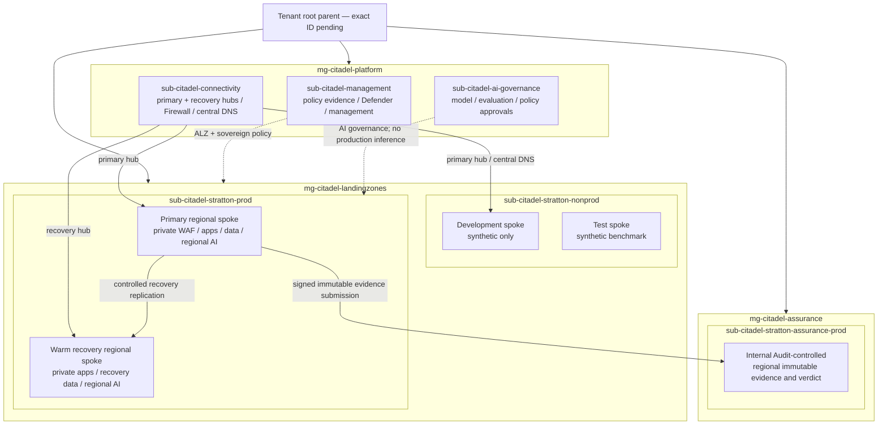
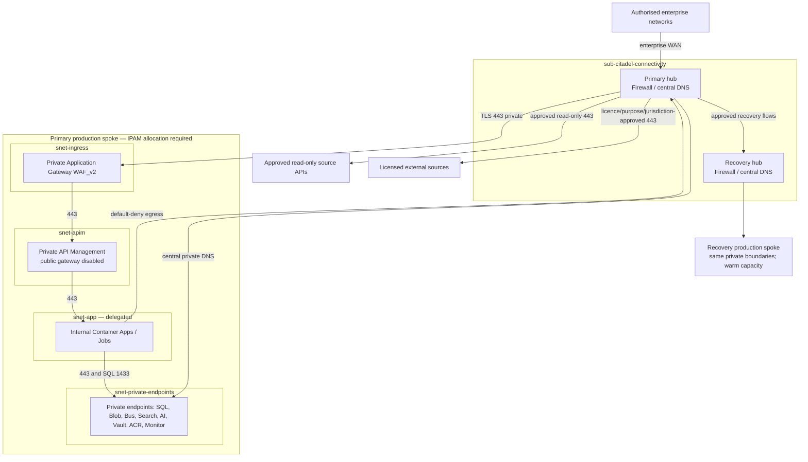

# Phase 3 — Azure Design: Stratton Release 1

**Case:** `Stratton-Europe-Captital`  
**Status:** Complete candidate; canonical hashing and AFF-A/AFF-B assurance are for the parent session  
**Model-plan revision:** `4` (`../0-coordination/stratton-model-plan-revision-4.json`)  
**Approved Phase 2 baseline:** manifest `8e4126fb1827e9747e0739e8401858ed53f0c3b630713c51d730ee0c611ed5a9`;
approval SHA-256 `61a917d712615071c70fbff53044a405aedc3460c3d0a5064a581bfa1e467ff3`

## 1. Executive summary

Release 1 is designed as a private, case-centred Azure application landing zone. Authorised users
reach private Application Gateway and API Management endpoints; internal Azure Container Apps run
workflow, policy and event-driven analysis; Azure SQL Database, Blob Storage and Azure AI Search hold
governed state and evidence; regional Azure OpenAI and Document Intelligence provide bounded,
assistive processing. Managed identities, fail-closed policy, immutable audit export and a separate
Internal Audit assurance boundary preserve human authority, source authority and independent
validation. All databases have public access disabled in every environment. No approved enterprise
topology is assumed: the human confirmed a new AI-focused landing zone named **Citadel**, separate
platform/workload subscriptions, a two-region pattern, enterprise hub-connected spokes and
evidence-led sizing. Exact tenant parent, subscription IDs, region names, CIDRs/DNS targets and
measured caps remain fail-closed implementation parameters.

### Design choices and trade-offs

| Choice | Decision | Material trade-off |
|---|---|---|
| Ingress | Private Application Gateway WAF_v2 → private API Management | Strong isolation; adds gateway, DNS and fixed cost |
| Compute | Internal Container Apps for interactive services; event-driven Jobs for packs | Elastic and simpler than AKS; benchmark sets safe limits |
| State | Private Azure SQL Database plus separate Blob accounts | Strong transactions and evidence lifecycle; cross-store recovery needs manifests |
| Retrieval/AI | Private Azure AI Search, regional Azure OpenAI, Document Intelligence | Grounded assistive analysis; region, quota and model remain approved inputs |
| Assurance | Immutable evidence and verdict store in an Internal Audit-controlled subscription | Preserves independence; adds subscription and operating overhead |
| Resilience | Zonal primary plus warm recovery in two approved regions | Higher fixed cost; exact region names remain fail-closed |
| Encryption | Platform-managed at-rest encryption baseline; CMK only if CISO/Legal justifies it | Avoids unnecessary key availability coupling |

## 2. Citadel architecture and landing-zone topology

The confirmed design creates **Citadel**, a case-specific AI-focused Azure platform. Citadel uses the
[Microsoft Azure Landing Zone enterprise-scale reference
architecture](https://learn.microsoft.com/en-us/azure/cloud-adoption-framework/ready/landing-zone/?tabs=conceptual)
as its platform/application foundation, adapts the
[Azure-Samples Foundry Citadel Platform](https://github.com/Azure-Samples/foundry-citadel-platform)
layered AI-governance architecture, and overlays
[Sovereign Landing Zone control principles](https://learn.microsoft.com/en-us/azure/azure-sovereign-clouds/public/implement-controls-principles)
and [sovereign policy design](https://learn.microsoft.com/en-us/azure/azure-sovereign-clouds/public/design-sovereign-policies).
Foundry Citadel is an opinionated Azure-Samples architecture—not a standalone Microsoft product and
not a replacement for Azure Landing Zones.

Editable and standalone views:
[solution/LZ `.drawio`](diagrams/stratton-solution-lz-topology.drawio) /
[SVG](diagrams/stratton-solution-lz-topology.svg);
[network `.drawio`](diagrams/stratton-network-security-boundaries.drawio) /
[SVG](diagrams/stratton-network-security-boundaries.svg);
[data flow `.drawio`](diagrams/stratton-end-to-end-data-flow.drawio) /
[SVG](diagrams/stratton-end-to-end-data-flow.svg).

### Human-decision dispositions

| ID | Confirmed design pattern | Remaining fail-closed parameter / owner |
|---|---|---|
| HD-001 | New Citadel composition: ALZ foundation + Foundry Citadel governance layers + SLZ overlays | Tenant parent, subscription IDs and policy versions / Enterprise Platform |
| HD-002 | Separate management, connectivity, AI-governance, nonprod, prod and assurance subscriptions | Subscription IDs, billing and owner groups / Platform, CISO, Internal Audit |
| HD-003 | Two approved regions; regional AI only; Global/DataZone denied | Exact primary/recovery names and signed evidence / General Counsel, DPO, CISO |
| HD-004 | Enterprise hub-connected spokes, central DNS and enterprise IPAM | CIDRs, WAN IDs and DNS targets / Network Lead |
| HD-005 | Evidence-led elastic sizing and first-three-deal benchmark | Measured user/pack/token profile and approved caps / CIO, Operations, source owners |

Full decision dispositions and remaining parameter ownership are in
[`stratton-human-decision-register.json`](evidence/stratton-human-decision-register.json); the
formal hierarchy, subscription and policy-layer contract is
[`stratton-citadel-landing-zone-contract.json`](evidence/stratton-citadel-landing-zone-contract.json).

### CAF organisation, naming and tags

Citadel uses `mg-citadel-platform`, `mg-citadel-landingzones` and `mg-citadel-assurance`.
Central subscriptions are `sub-citadel-management`, `sub-citadel-connectivity` and
`sub-citadel-ai-governance`; they do not contain production inference or Internal Audit verdicts.
Workload subscriptions are `sub-citadel-stratton-nonprod`, `sub-citadel-stratton-prod` and
`sub-citadel-stratton-assurance-prod`. These are logical CAF names; exact Azure subscription IDs and
tenant parent remain inputs.

Resource groups use `rg-stratton-<env>-<locationCode>-<function>` for `network`, `application`,
`data`, `ai`, `operations` and `security`; assurance uses
`rg-stratton-prd-<locationCode>-assurance`. Names follow the [CAF naming
guidance](https://learn.microsoft.com/azure/cloud-adoption-framework/ready/azure-best-practices/resource-naming)
but the enterprise standard wins when evidenced.

| Tag | Value/source | Enforcement |
|---|---|---|
| `environment` | `dev`, `tst`, `prd` | Required |
| `workload` | `stratton-release-1` | Fixed |
| `owner` | approved owner input | No production default |
| `costCenter` | approved cost-centre input | No production default |
| `dataClassification` | `synthetic` or `highly-confidential` | Environment policy |
| `criticality` | `nonproduction` or `business-critical` | Environment policy |
| `managedBy` | `bicep` | Fixed |

## 3. Network design and trust boundaries

No environment peers directly with another. `sub-citadel-connectivity` contains primary and recovery
regional hubs, each with Azure Firewall Premium, Private DNS Resolver and an approved enterprise WAN
connection. Every workload VNet is a corresponding hub-connected spoke using Network Lead-approved
enterprise IPAM. The production spokes use purpose-specific subnets:
`snet-ingress` (minimum `/27`), `snet-apim` (`/27`), delegated `snet-app` (`/23`) and
`snet-private-endpoints` (`/24`). Prefix sizes are design constraints, not allocated CIDRs. A
dedicated `AzureFirewallSubnet` (`/26`) and resolver endpoint subnets (`/28`) are required in each
Citadel regional hub.

Citadel centrally owns private DNS in `sub-citadel-connectivity`, using Microsoft-documented zones
including `privatelink.database.windows.net`,
`privatelink.blob.core.windows.net`, `privatelink.servicebus.windows.net`,
`privatelink.search.windows.net`, `privatelink.openai.azure.com`,
`privatelink.cognitiveservices.azure.com`, `privatelink.vaultcore.azure.net` and the Monitor
Private Link zones. Duplicate workload-owned zones are prohibited.
See [Private Endpoint DNS](https://learn.microsoft.com/azure/private-link/private-endpoint-dns) and
the full [network contract](evidence/stratton-network-security-contract.json).

Before AFF-4 can plan a private-only Application Gateway, it must capture evidence that
`Microsoft.Network/EnableApplicationGatewayNetworkIsolation` is `Registered` in every target
subscription. Missing or incomplete registration evidence blocks the private-ingress module; no
public frontend fallback is allowed. See [Private Application Gateway
deployment](https://learn.microsoft.com/azure/application-gateway/application-gateway-private-deployment).

**Fail-closed rules:** deny public SQL and API Management in
dev/test/production-primary/production-recovery; deny supported public data/AI/configuration
endpoints; deny Global/DataZone AI deployments and any resource or replication outside the signed
region pair;
deny direct Internet/DNS, broad inbound rules, environment peering, source write-back and unapproved
transfers. API Management public access is disabled only after its private endpoint is approved and
private DNS resolves, and it is never restored as a fallback. Egress requires source owner, licence,
purpose, jurisdiction and expiry evidence.

## 4. Resource inventory and Azure Verified Modules

SKUs are initial engineering hypotheses, not achieved capacity or commercial estimates. Feature,
quota and SKU availability must be verified in the approved location.

| CAF name/pattern | Azure resource and starting SKU | Environment | Pinned AVM candidate |
|---|---|---|---|
| `mg-citadel-platform` | Platform management group | platform | Tenant-scope verification required |
| `mg-citadel-landingzones` | Workload management group | workload | Tenant-scope verification required |
| `mg-citadel-assurance` | Internal Audit management group | assurance | Tenant-scope verification required |
| `sub-citadel-management` | Management/policy/platform observability subscription | platform | Subscription vending pattern |
| `sub-citadel-connectivity` | Two regional hubs, firewalls and central DNS | platform | Subscription vending pattern |
| `sub-citadel-ai-governance` | AI policy/evaluation/approval governance subscription | platform | Subscription vending pattern |
| `sub-citadel-stratton-nonprod` | Development/test workload subscription | nonprod | Subscription vending pattern |
| `sub-citadel-stratton-prod` | Primary/recovery production workload subscription | prod | Subscription vending pattern |
| `sub-citadel-stratton-assurance-prod` | Internal Audit-controlled assurance subscription | assurance | Subscription vending pattern |
| `policy-citadel-*` | ALZ baseline + Citadel AI + SLZ policy overlays | inherited | Tenant-scope verification required |
| `log-citadel-management-<loc>` | Central platform Log Analytics | platform | `avm/res/operational-insights/workspace:0.12.0` |
| `stcitadelgovernance<suffix>` | Private AI-governance artefact storage; no source documents | platform | `avm/res/storage/storage-account:0.25.0` |
| `appcs-citadel-ai-governance-*` | Versioned policy/model approval references | platform | `avm/res/app-configuration/configuration-store:0.7.1` |
| `rg-stratton-<env>-<loc>-<fn>` | Resource group | all | `avm/res/resources/resource-group:0.4.1` |
| `vnet-citadel-hub-<regionRole>-<loc>` | Regional hub VNet | platform | `avm/res/network/virtual-network:0.7.0` |
| `vnet-stratton-<env>-<regionRole>-<loc>` | Hub-connected spoke VNet | all | `avm/res/network/virtual-network:0.7.0` |
| `nsg-stratton-<env>-<purpose>` | NSG | all | `avm/res/network/network-security-group:0.5.1` |
| `rt-stratton-<env>-<purpose>` | Route table | all | `avm/res/network/route-table:0.4.1` |
| `afw-citadel-<regionRole>-<loc>` | Azure Firewall Premium in each regional hub | platform | `avm/res/network/azure-firewall:0.5.0` |
| `agw-stratton-<env>-<loc>` | Application Gateway WAF_v2 | test/prod | `avm/res/network/application-gateway:0.6.0` |
| `pdns-<service>` | Centrally owned private DNS zones | connectivity | `avm/res/network/private-dns-zone:0.7.1` |
| `pep-stratton-<env>-<service>` | Private endpoints | all | `avm/res/network/private-endpoint:0.11.0` |
| `apim-stratton-<env>-<loc>-<suffix>` | API Management Standard v2, 1/2-unit hypothesis; private endpoint then `publicNetworkAccess=Disabled` | all | `avm/res/api-management/service:0.11.0` |
| `cae-stratton-<env>-<loc>` | Internal Container Apps workload-profile environment | all | `avm/res/app/managed-environment:0.8.1` |
| `ca-stratton-<env>-<component>` | Container Apps; prod min two interactive replicas | all | `avm/res/app/container-app:0.11.0` |
| `caj-stratton-<env>-<component>` | Container Apps Jobs; event-driven | all | Hand-written child pending AVM check |
| `acrstratton<env><suffix>` | Container Registry Premium | all | `avm/res/container-registry/registry:0.8.0` |
| `sbns-stratton-<env>-<loc>-<suffix>` | Service Bus Standard / Premium 1 MU hypothesis | all | `avm/res/service-bus/namespace:0.11.0` |
| `sql-stratton-<env>-<regionRole>-<loc>-<suffix>` | SQL logical servers; Entra-only; public disabled; prod failover group | all | `avm/res/sql/server:0.17.0` |
| `sqldb-stratton-<env>-case` | GP serverless nonprod / BC 2-vCore prod hypothesis; `requestedBackupStorageRedundancy` Local or Zone only | all | `avm/res/sql/server:0.17.0` |
| `ststratton<env>evidence<suffix>` | Blob LRS nonprod / ZRS prod; private | all | `avm/res/storage/storage-account:0.25.0` |
| `ststratton<env>work<suffix>` | Temporary work Blob; private | all | `avm/res/storage/storage-account:0.25.0` |
| `ststrattonprd<regionRole>audit<suffix>` | Regional ZRS immutable audit Blob | prod | `avm/res/storage/storage-account:0.25.0` |
| `ststrattonprd<regionRole>verdict<suffix>` | Regional ZRS immutable verdict Blob | assurance | `avm/res/storage/storage-account:0.25.0` |
| `srch-stratton-<env>-<loc>-<suffix>` | AI Search S1; prod 3 replicas/1 partition hypothesis | all | `avm/res/search/search-service:0.11.0` |
| `oai-stratton-<env>-<loc>-<suffix>` | Azure OpenAI S0 regional; model/quota unresolved | all | `avm/res/cognitive-services/account:0.12.0` |
| `docai-stratton-<env>-<loc>-<suffix>` | Document Intelligence S0 | all | `avm/res/cognitive-services/account:0.12.0` |
| `kv-stratton-<env>-<loc>-<suffix>` | Key Vault Standard | all | `avm/res/key-vault/vault:0.13.3` |
| `appcs-stratton-<env>-<loc>-<suffix>` | App Configuration Standard | all | `avm/res/app-configuration/configuration-store:0.7.1` |
| `log-stratton-<env>-<loc>` | Log Analytics `PerGB2018` | all | `avm/res/operational-insights/workspace:0.12.0` |
| `appi-stratton-<env>-<loc>` | Workspace-based Application Insights | all | `avm/res/insights/component:0.6.0` |
| `ag-stratton-<env>-operations` | Action Group | all | `avm/res/insights/action-group:0.5.1` |
| `id-stratton-<env>-<component>` | User-assigned managed identities | all | `avm/res/managed-identity/user-assigned-identity:0.4.1` |
| `diag-stratton-<resource>` | Diagnostic settings | all | `avm/res/insights/diagnostic-setting:0.7.2` |

References are exact candidates from the [AVM Bicep
index](https://azure.github.io/Azure-Verified-Modules/indexes/bicep/bicep-resource-modules/), never
`latest`. AFF-4 must resolve each version and capture registry integrity before use.

## 5. Security design

### Identity, access and independence

- Human access uses Stratton-controlled Microsoft Entra identities and application roles.
- Production privilege is PIM-eligible, approval-based, time-bound, phishing-resistant-MFA
  protected and restricted to authorised EU-based personnel. No standing workload `Owner`.
- Each component/environment has a user-assigned managed identity. SQL authentication, shared client
  secrets, stored credentials and GitHub OIDC are prohibited.
- SQL uses Entra-only contained roles. Key Vault uses RBAC, private access, purge protection and soft
  delete.
- Internal Audit controls the assurance subscription and immutable verdict store. Delivery may
  submit signed evidence but cannot issue, replace or delete a verdict.

The exact role matrix is in
[`stratton-identity-rbac-contract.json`](evidence/stratton-identity-rbac-contract.json); PIM adapts
[Microsoft guidance](https://learn.microsoft.com/entra/id-governance/privileged-identity-management/pim-configure).

### Data, AI and legal controls

- A mandatory `EvidenceEnvelope` binds every item to case, source, owner, timestamp, licence,
  purpose, classification, quality, hash and admission state. Missing fields deny analysis.
- Production data is highly confidential and remains in production. Non-production is synthetic.
- External data stays quarantined until licence, AI-assisted use and purpose pass.
- Azure OpenAI is regional and private. Fine-tuning, autonomous tools and foundation-model training
  with Stratton data are absent. Global and DataZone deployment types are denied by Citadel policy.
  Provider terms/configuration are verified against [Microsoft's data
  privacy statement](https://learn.microsoft.com/legal/cognitive-services/openai/data-privacy) before
  enablement.
- No DORA compliance or EU AI Act risk classification claim is made while its owner evidence remains
  open. Foreign-jurisdiction exposure requires General Counsel acceptance.
- Platform-managed encryption is the baseline. CMK is introduced only by an explicit, justified
  decision.

## 6. Data, APIs and end-to-end flow

Azure SQL stores case, eligibility, source registration, evidence metadata, analysis-run, claim,
citation, review, policy and work-item state. Blob Storage separates quarantine, admitted evidence,
temporary work, audit and verdict objects. Azure AI Search holds rebuildable derived chunks; it is not
authoritative.

`Read-only source → private quarantine → fail-closed admission → evidence envelope → extraction/index
→ assistive analysis → cited draft → human/specialist review → committee-ready draft`

Every API uses private TLS, Entra OAuth/managed identity, application role plus case/purpose policy,
`traceparent`, `x-case-id` and idempotency keys. Request limits are HD-005 parameters. Dependency
failure returns deny or an idempotent bounded retry; no ungrounded fallback is allowed. Full entities,
indexes, OpenAPI operations, errors, queues and connector contracts are in
[`stratton-data-api-contracts.json`](evidence/stratton-data-api-contracts.json).

## 7. Reliability, observability and operations

| State | Production design | Recovery position |
|---|---|---|
| Case/policy/review metadata | Zone-redundant SQL Business Critical hypothesis in primary/recovery with failover group and Local/Zone STR/LTR backup redundancy | RPO ≤1h/RTO ≤4h design target |
| Evidence | Separate ZRS accounts in the approved pair; versions, hashes and controlled replication | Fail over by case and recovery manifest |
| Search | Primary S1 three-replica hypothesis; warm/rebuildable recovery service | Rebuild from replicated admitted evidence |
| Work queues | Regional Service Bus Premium namespaces, sessions, dedupe and DLQ | Reconcile/replay because metadata failover does not copy all messages |
| Audit | SQL outbox → regional ZRS immutable Blob | Verify replicated hash chain before reopen |
| Verdict | Regional assurance Blob under Internal Audit control | Assurance-owned replication and recovery |

The two-region design pattern is confirmed. Both exact region names remain empty fail-closed
parameters under VAL-005; no deployment, replication or regional objective claim is valid before
those names and service availability are verified.

Every Azure SQL database requires an explicit `requestedBackupStorageRedundancy` value. Production
has no default and permits only `Local` or `Zone` after the approved region's capability is proven;
`Geo` and `GeoZone` are denied because they use an implicit Azure paired region. The value applies
to STR and LTR, and changes affect future backups only. Regional recovery uses the explicitly
approved SQL failover group rather than geo-restore.

OpenTelemetry traces, structured logs, resource metrics and diagnostics correlate `caseId`,
`workItemId`, `evidenceId`, `analysisRunId`, `policyDecisionId` and `reviewId`. Document, prompt and
completion bodies, secrets and tokens are prohibited in telemetry. Retention has no invented default.
Critical alerts cover policy failure, public access, audit lag, DLQ, PIM/emergency access, backup,
model/configuration change, unapproved egress and the 20-deal stop. Twelve runbooks and detailed
failure behaviours are in
[`stratton-operations-reliability-contract.json`](evidence/stratton-operations-reliability-contract.json).
No achieved availability, performance, RPO or RTO is claimed.

## 8. WAF balance, environment and cost

| WAF pillar | Design response | Explicit cost/risk |
|---|---|---|
| Reliability | Zonal primary, warm recovery, failover group, durable work and recovery manifests | Duplicate regional capacity and cross-store rehearsal |
| Security | Citadel ALZ/AI/sovereign policy layers, private paths, PIM and isolated assurance | More subscriptions, policy ownership and fixed network cost |
| Cost Optimisation | Evidence-led elastic sizing, rebuildable search and lower warm capacity | Two regional hubs and recovery services are material fixed cost |
| Operational Excellence | One Bicep codebase, pinned ALZ/AVM/Foundry Citadel inputs, diagnostics and runbooks | Upstream architecture/version lifecycle needs active governance |
| Performance Efficiency | Separate interactive/pack paths, regional inference and tested caps | Exact caps remain pending the confirmed HD-005 benchmark method |

Dev and test use synthetic data, Citadel hub-connected private spokes, separate identities and SQL
public access disabled. Production uses primary/recovery spokes in its separate subscription;
assurance remains in the Internal Audit subscription. Capacity hypotheses are not customer facts.

No price or currency is asserted because exact region names, volume, quota, hours, subscription IDs
and commercial terms are unknown. Main drivers are two Citadel hubs/firewalls/resolvers, model
tokens/quota, Search replicas, SQL tier, APIM/Application Gateway, warm recovery, immutable storage
and log retention. AFF-4 must produce an
owner-approved [Azure Pricing Calculator](https://azure.microsoft.com/pricing/calculator/) estimate
after exact location, IPAM and benchmark inputs. Full WAF and cost matrices are in
[`stratton-waf-cost-environment-matrix.json`](evidence/stratton-waf-cost-environment-matrix.json).

## 9. Traceability and governed controls

Coverage is **31/31 Must requirements**, **19/19 ABBs**, **10/10 approved decisions preserved**, and
**7/7 governed validation controls carried without waiver**. The seven controls remain formal design
evidence despite not being shown on the dashboard:

| Control | Production/acceptance gate |
|---|---|
| VAL-001 | DORA applicability/exemption and obligations before any formal claim/scope change |
| VAL-002 | Business hours, typical pack and critical alerts before service/performance acceptance |
| VAL-003 | Eligibility/benchmark/critical-field/severity/exception definitions before validation |
| VAL-004 | Exact sources, schedules, volumes and remediation before production ingestion |
| VAL-005 | Approved locations and transfer-exception process before production acceptance |
| AFFB-RES-001 | AI Act role/use-case classification evidence before production or claim |
| AFFB-RES-002 | Official citations, dates and article mappings before formal representation |

The complete mapping is
[`stratton-traceability-matrix.json`](evidence/stratton-traceability-matrix.json). No approved
requirement, ABB or decision is changed.

## 10. Deployment approach and AFF-4 handoff

AFF-4 should plan one modular Bicep codebase with environment parameter files, pinned AVM candidates
and a pinned/reviewed Foundry Citadel source revision:

`Citadel management groups/subscriptions → ALZ + AI-governance + sovereign policies → regional
hubs/central DNS → identities/management → workload spokes → monitoring → regional data/integration/
AI/application/ingress → assurance → diagnostics`.

The design patterns are confirmed; exact parameters have no defaults for tenant parent, subscription
IDs, both region names/evidence, all IPAM/WAN/DNS values, owners, cost centre, support receivers,
retention, source register, measured workload caps, model/version/quota, provider data-use evidence
or Internal Audit groups. Compile-time and Azure Policy checks deny unapproved locations,
Global/DataZone AI, public data services, secrets, public ingress, overlapping/unapproved CIDRs and
missing tags. Deployment uses
human-interactive Azure sign-in or a separately approved runtime managed identity; no credentials are
stored. Phase 3 performs no coding, deployment, `what-if` or runtime tests.

The implementation contract, local validation plan, acceptance inputs and release sequence are in
[`stratton-aff4-handoff.json`](evidence/stratton-aff4-handoff.json).

### Future considerations

1. Implement and test the confirmed cross-region SQL failover, evidence replication,
   Search/registry recovery and private DNS failover after exact regions pass VAL-005.
2. Reassess SQL/Search/APIM capacity and reserved commitments after representative measured load.
3. Consider CMK or Managed HSM only if a documented control requires customer key custody.
4. Integrate Citadel management telemetry with the accountable enterprise Microsoft Sentinel/SOC
   service when its workspace and ownership are evidenced.
5. Expand beyond 20 deals, add special-category data, custom document models or external
   communications only through governed requirements and architecture change.

## 11. Evidence and candidate boundary

The [source register](evidence/stratton-source-register.json) records each Microsoft Learn, Azure
Architecture Center and Azure-Samples URL and what is reused or adapted. The catalogue and evidence
are authoritative for detailed matrices. Standalone SVGs contain titles/descriptions, no script,
foreign object or
external reference. This candidate creates no final hash manifest, reviewer record, approval,
dashboard/overview update or run-journal event.
